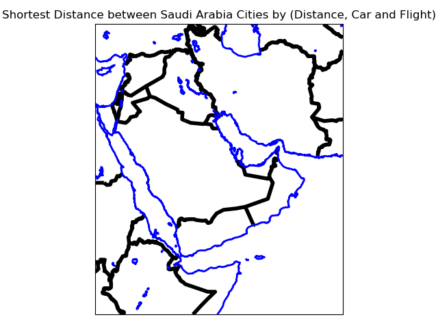
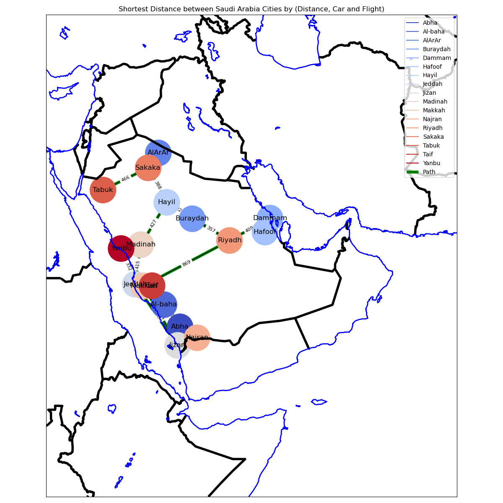

## **Implement Python Code:**
```python
import os
import sys
import time
import traceback
from heapq import heappop, heappush

os.environ["PROJ_LIB"] = os.path.join(os.environ["CONDA_PREFIX"], "share", "proj")

import matplotlib as mpl  # visualization
import pandas as pd  # data manipulate
import networkx as nx  # draw a graph
import matplotlib.pyplot as plt  # show plt
from matplotlib.pyplot import figure, text

from mpl_toolkits.basemap import Basemap as Basemap  # map
```

### **Configuration the Basemap to Saudi Arabia.**
 Basemap package provides a lot of methods to dealing with maps with a different types of maps and customization propriety.
# initialize base map to Saudi Arabia

```python
# initialize base map to Saudi Arabia
m = Basemap(
    projection='merc',  # map type
    llcrnrlon=32,  # lower corner Longitude
    llcrnrlat=5,  # lower corner latitude
    urcrnrlon=65,  # upper corner Longitude
    urcrnrlat=40,  # upper corner Latitude
    resolution='i',  # intermediate map resolution
)
```

####when calling plot.show() the result will be like below image:

#### **Loading data using pandas.**
```python
        # load data file
        df = pd.read_csv('')
        # print first few rows
        print(f'Data Head {df.head()}')
        # print data types for all features
        print(f"Data Type {df.dtypes}")
        # split the coronations to lat and long for source, and convert it to float
        df['Long'] = df['source coord'].str.split(',').str[1].astype(float)
        df['Lat'] = df['source coord'].str.split(',').str[0].astype(float)
        # split the coronations to lat and long for target, and convert it to float
        df['LongT'] = df['target coord'].str.split(',').str[1].astype(float)
        df['LatT'] = df['target coord'].str.split(',').str[0].astype(float)
        # add edges to graph with specific wights
        # loop throw all dataframe data
```

#### **Draw Paths between cities.**
```python
        for index, row in df.iterrows():
            graph.add_edge(row['from'], row['to'], length=row['distance'],
                           time_by_car=row['time by car'], time_by_flight=row['time by flight'])
        # specify color for each edge to make it recognize for legend
        color_edge = {k: v for v, k in enumerate(sorted(set(graph.nodes())))}
        low, *_, high = sorted(color_edge.values())
        norm = mpl.colors.Normalize(vmin=low, vmax=high, clip=True)
        mapper = mpl.cm.ScalarMappable(norm=norm, cmap=mpl.cm.coolwarm)

        # create variables to get position for cities to place Edge in correct place base on coordinates
        mx, my = m(df['Long'].values, df['Lat'].values)
        tx, ty = m(df['LongT'].values, df['LatT'].values)
        pos = {}
        # loop throw all cities from and to then add value to pos directory
        for count, elem in enumerate(df['from']):
            pos[elem] = (mx[count], my[count])
        for count, elem in enumerate(df['to']):
            pos[elem] = (tx[count], ty[count])

        # setup plot
        fig, ax = plt.subplots(1, figsize=(12, 12))

        # create labels for Edge
        for label in color_edge:
            ax.plot([0], [0], color=mapper.to_rgba(color_edge[label]), label=label)

        new_labels = dict(
            map(lambda x: ((x[0], x[1]), str(x[2]['length'])), graph.edges(data=True)))
        # add distances between cities
        nx.draw_networkx_edge_labels(graph, pos=pos, edge_labels=new_labels, font_size=8)

        # start drawing edge on graph to specify path color, post and edges list
        nx.draw_networkx_edges(
            graph, pos,
            edgelist=graph.edges,
            edge_color='green',
            width=5,
            label="Path",
        )

        # draw the graph with size and position
        nx.draw_networkx(graph, pos,
                         nodelist=color_edge,
                         node_size=2000,
                         node_color=[mapper.to_rgba(i)
                                     for i in color_edge.values()],
                         with_labels=False)
        for node, (x, y) in pos.items():
            # change text size for nodes (City Name)
            text(x, y, node, fontsize=12, ha='center', va='center')
        # add legend
        plt.legend()
        # Now draw the map
        # draw countries border with black color
        m.drawcountries(linewidth=4, color='black')
        # draw coastlines with blue color
        m.drawcoastlines(linewidth=2, color='blue')
        # add title to plot
        plt.title('Shortest Distance between Saudi Arabia Cities by (Distance, Car and Flight)')
        # adjusts subplot params so that the subplot(s) fits in to the figure area
        plt.tight_layout()
        # show graph with map
        plt.show()

        # find short path using differences weight
        # my hone city is Taif near to Makkah, this will be the source for path
        # Shortest path by distance or length
        start_time = time.time()
        print_path(graph, 'length')
        # Shortest path by time by a car
        print_path(graph, 'time_by_car')
        # Shortest path by time by a flight
        print_path(graph, 'time_by_flight')

        get_program_running(start_time)
```



There are many cities close to other “nodes overlap” , the only way to avoid this is coloring the nodes with different colors and add legend, because the node depended on location on the map.

### **Find Short path using dijkstra's algorithm.**
In a weighted graph, one algorithm for finding the shortest path from a starting node to a target node is Dijkstra's algorithm. A tree of the shortest paths from the starting vertex, the source, to all other points in the graph is generated by the algorithm.

```python

        # find short path using differences weight
        # my hone city is Taif near to Makkah, this will be the source for path
        # Shortest path by distance or length
        start_time = time.time()
        print_path(graph, 'length')
        # Shortest path by time by a car
        print_path(graph, 'time_by_car')
        # Shortest path by time by a flight
        print_path(graph, 'time_by_flight')

        get_program_running(start_time)
```

Result:

```commandline
Data Head       from       to         source coord  ... distance  time by car  time by flight
0   Dammam   Riyadh  26.399250,49.984360  ...      409         4.00               1
1   Riyadh   Makkah  24.774265,46.738586  ...      869         9.00               3
2   Makkah   Jeddah  21.422510,39.826168  ...       89         0.44               5
3   Jeddah  Madinah  21.543333,39.172779  ...      415         4.00               1
4  Al-baha     Abha    20.01288,41.46767  ...      332         3.00               5

[5 rows x 7 columns]
Data Type from               object
to                 object
source coord       object
target coord       object
distance            int64
time by car       float64
time by flight      int64
dtype: object
({'Taif': 0, 'Makkah': 90, 'Jeddah': 179, 'Yanbu': 511, 'Madinah': 594, 'Jizan': 779, 'Riyadh': 959, 'Hayil': 1021, 'Najran': 1112, 'Buraydah': 1248, 'Dammam': 1368, 'Abha': 1368, 'Sakaka': 1409, 'Hafoof': 1515, 'AlArAr': 1594, 'Al-baha': 1700, 'Tabuk': 1875}, {'Taif': ['Taif'], 'Makkah': ['Taif', 'Makkah'], 'Riyadh': ['Taif', 'Makkah', 'Riyadh'], 'Jeddah': ['Taif', 'Makkah', 'Jeddah'], 'Jizan': ['Taif', 'Makkah', 'Jizan'], 'Madinah': ['Taif', 'Makkah', 'Jeddah', 'Madinah'], 'Yanbu': ['Taif', 'Makkah', 'Jeddah', 'Yanbu'], 'Hayil': ['Taif', 'Makkah', 'Jeddah', 'Madinah', 'Hayil'], 'Najran': ['Taif', 'Makkah', 'Jizan', 'Najran'], 'Abha': ['Taif', 'Makkah', 'Jizan', 'Najran', 'Abha'], 'Dammam': ['Taif', 'Makkah', 'Riyadh', 'Dammam'], 'Buraydah': ['Taif', 'Makkah', 'Jeddah', 'Madinah', 'Hayil', 'Buraydah'], 'Sakaka': ['Taif', 'Makkah', 'Jeddah', 'Madinah', 'Hayil', 'Sakaka'], 'Hafoof': ['Taif', 'Makkah', 'Riyadh', 'Dammam', 'Hafoof'], 'Al-baha': ['Taif', 'Makkah', 'Jizan', 'Najran', 'Abha', 'Al-baha'], 'Tabuk': ['Taif', 'Makkah', 'Jeddah', 'Madinah', 'Hayil', 'Sakaka', 'Tabuk'], 'AlArAr': ['Taif', 'Makkah', 'Jeddah', 'Madinah', 'Hayil', 'Sakaka', 'AlArAr']})
{'Taif': 0, 'Makkah': 90, 'Jeddah': 179, 'Yanbu': 511, 'Madinah': 594, 'Jizan': 779, 'Riyadh': 959, 'Hayil': 1021, 'Najran': 1112, 'Buraydah': 1248, 'Dammam': 1368, 'Abha': 1368, 'Sakaka': 1409, 'Hafoof': 1515, 'AlArAr': 1594, 'Al-baha': 1700, 'Tabuk': 1875}
{'Taif': ['Taif'], 'Makkah': ['Taif', 'Makkah'], 'Riyadh': ['Taif', 'Makkah', 'Riyadh'], 'Jeddah': ['Taif', 'Makkah', 'Jeddah'], 'Jizan': ['Taif', 'Makkah', 'Jizan'], 'Madinah': ['Taif', 'Makkah', 'Jeddah', 'Madinah'], 'Yanbu': ['Taif', 'Makkah', 'Jeddah', 'Yanbu'], 'Hayil': ['Taif', 'Makkah', 'Jeddah', 'Madinah', 'Hayil'], 'Najran': ['Taif', 'Makkah', 'Jizan', 'Najran'], 'Abha': ['Taif', 'Makkah', 'Jizan', 'Najran', 'Abha'], 'Dammam': ['Taif', 'Makkah', 'Riyadh', 'Dammam'], 'Buraydah': ['Taif', 'Makkah', 'Jeddah', 'Madinah', 'Hayil', 'Buraydah'], 'Sakaka': ['Taif', 'Makkah', 'Jeddah', 'Madinah', 'Hayil', 'Sakaka'], 'Hafoof': ['Taif', 'Makkah', 'Riyadh', 'Dammam', 'Hafoof'], 'Al-baha': ['Taif', 'Makkah', 'Jizan', 'Najran', 'Abha', 'Al-baha'], 'Tabuk': ['Taif', 'Makkah', 'Jeddah', 'Madinah', 'Hayil', 'Sakaka', 'Tabuk'], 'AlArAr': ['Taif', 'Makkah', 'Jeddah', 'Madinah', 'Hayil', 'Sakaka', 'AlArAr']}
({'Taif': 0, 'Makkah': 0.45, 'Jeddah': 0.89, 'Yanbu': 3.89, 'Madinah': 4.89, 'Jizan': 6.45, 'Hayil': 8.89, 'Riyadh': 9.45, 'Najran': 9.45, 'Buraydah': 10.89, 'Abha': 12.45, 'Sakaka': 12.89, 'Dammam': 13.45, 'AlArAr': 13.89, 'Hafoof': 14.45, 'Al-baha': 15.45, 'Tabuk': 16.89}, {'Taif': ['Taif'], 'Makkah': ['Taif', 'Makkah'], 'Riyadh': ['Taif', 'Makkah', 'Riyadh'], 'Jeddah': ['Taif', 'Makkah', 'Jeddah'], 'Jizan': ['Taif', 'Makkah', 'Jizan'], 'Madinah': ['Taif', 'Makkah', 'Jeddah', 'Madinah'], 'Yanbu': ['Taif', 'Makkah', 'Jeddah', 'Yanbu'], 'Hayil': ['Taif', 'Makkah', 'Jeddah', 'Madinah', 'Hayil'], 'Najran': ['Taif', 'Makkah', 'Jizan', 'Najran'], 'Abha': ['Taif', 'Makkah', 'Jizan', 'Najran', 'Abha'], 'Buraydah': ['Taif', 'Makkah', 'Jeddah', 'Madinah', 'Hayil', 'Buraydah'], 'Sakaka': ['Taif', 'Makkah', 'Jeddah', 'Madinah', 'Hayil', 'Sakaka'], 'Dammam': ['Taif', 'Makkah', 'Riyadh', 'Dammam'], 'Al-baha': ['Taif', 'Makkah', 'Jizan', 'Najran', 'Abha', 'Al-baha'], 'Tabuk': ['Taif', 'Makkah', 'Jeddah', 'Madinah', 'Hayil', 'Sakaka', 'Tabuk'], 'AlArAr': ['Taif', 'Makkah', 'Jeddah', 'Madinah', 'Hayil', 'Sakaka', 'AlArAr'], 'Hafoof': ['Taif', 'Makkah', 'Riyadh', 'Dammam', 'Hafoof']})
{'Taif': 0, 'Makkah': 0.45, 'Jeddah': 0.89, 'Yanbu': 3.89, 'Madinah': 4.89, 'Jizan': 6.45, 'Hayil': 8.89, 'Riyadh': 9.45, 'Najran': 9.45, 'Buraydah': 10.89, 'Abha': 12.45, 'Sakaka': 12.89, 'Dammam': 13.45, 'AlArAr': 13.89, 'Hafoof': 14.45, 'Al-baha': 15.45, 'Tabuk': 16.89}
{'Taif': ['Taif'], 'Makkah': ['Taif', 'Makkah'], 'Riyadh': ['Taif', 'Makkah', 'Riyadh'], 'Jeddah': ['Taif', 'Makkah', 'Jeddah'], 'Jizan': ['Taif', 'Makkah', 'Jizan'], 'Madinah': ['Taif', 'Makkah', 'Jeddah', 'Madinah'], 'Yanbu': ['Taif', 'Makkah', 'Jeddah', 'Yanbu'], 'Hayil': ['Taif', 'Makkah', 'Jeddah', 'Madinah', 'Hayil'], 'Najran': ['Taif', 'Makkah', 'Jizan', 'Najran'], 'Abha': ['Taif', 'Makkah', 'Jizan', 'Najran', 'Abha'], 'Buraydah': ['Taif', 'Makkah', 'Jeddah', 'Madinah', 'Hayil', 'Buraydah'], 'Sakaka': ['Taif', 'Makkah', 'Jeddah', 'Madinah', 'Hayil', 'Sakaka'], 'Dammam': ['Taif', 'Makkah', 'Riyadh', 'Dammam'], 'Al-baha': ['Taif', 'Makkah', 'Jizan', 'Najran', 'Abha', 'Al-baha'], 'Tabuk': ['Taif', 'Makkah', 'Jeddah', 'Madinah', 'Hayil', 'Sakaka', 'Tabuk'], 'AlArAr': ['Taif', 'Makkah', 'Jeddah', 'Madinah', 'Hayil', 'Sakaka', 'AlArAr'], 'Hafoof': ['Taif', 'Makkah', 'Riyadh', 'Dammam', 'Hafoof']}
({'Taif': 0, 'Makkah': 2, 'Riyadh': 5, 'Jizan': 5, 'Dammam': 6, 'Buraydah': 6, 'Hayil': 6, 'Jeddah': 7, 'Hafoof': 7, 'Madinah': 8, 'Yanbu': 8, 'Najran': 9, 'Abha': 9, 'Sakaka': 12, 'Al-baha': 14, 'AlArAr': 16, 'Tabuk': 19}, {'Taif': ['Taif'], 'Makkah': ['Taif', 'Makkah'], 'Riyadh': ['Taif', 'Makkah', 'Riyadh'], 'Jeddah': ['Taif', 'Makkah', 'Jeddah'], 'Jizan': ['Taif', 'Makkah', 'Jizan'], 'Dammam': ['Taif', 'Makkah', 'Riyadh', 'Dammam'], 'Buraydah': ['Taif', 'Makkah', 'Riyadh', 'Buraydah'], 'Hayil': ['Taif', 'Makkah', 'Riyadh', 'Hayil'], 'Najran': ['Taif', 'Makkah', 'Jizan', 'Najran'], 'Abha': ['Taif', 'Makkah', 'Jizan', 'Abha'], 'Hafoof': ['Taif', 'Makkah', 'Riyadh', 'Dammam', 'Hafoof'], 'Sakaka': ['Taif', 'Makkah', 'Riyadh', 'Hayil', 'Sakaka'], 'Madinah': ['Taif', 'Makkah', 'Jeddah', 'Madinah'], 'Yanbu': ['Taif', 'Makkah', 'Jeddah', 'Yanbu'], 'Al-baha': ['Taif', 'Makkah', 'Jizan', 'Abha', 'Al-baha'], 'Tabuk': ['Taif', 'Makkah', 'Riyadh', 'Hayil', 'Sakaka', 'Tabuk'], 'AlArAr': ['Taif', 'Makkah', 'Riyadh', 'Hayil', 'Sakaka', 'AlArAr']})
{'Taif': 0, 'Makkah': 2, 'Riyadh': 5, 'Jizan': 5, 'Dammam': 6, 'Buraydah': 6, 'Hayil': 6, 'Jeddah': 7, 'Hafoof': 7, 'Madinah': 8, 'Yanbu': 8, 'Najran': 9, 'Abha': 9, 'Sakaka': 12, 'Al-baha': 14, 'AlArAr': 16, 'Tabuk': 19}
{'Taif': ['Taif'], 'Makkah': ['Taif', 'Makkah'], 'Riyadh': ['Taif', 'Makkah', 'Riyadh'], 'Jeddah': ['Taif', 'Makkah', 'Jeddah'], 'Jizan': ['Taif', 'Makkah', 'Jizan'], 'Dammam': ['Taif', 'Makkah', 'Riyadh', 'Dammam'], 'Buraydah': ['Taif', 'Makkah', 'Riyadh', 'Buraydah'], 'Hayil': ['Taif', 'Makkah', 'Riyadh', 'Hayil'], 'Najran': ['Taif', 'Makkah', 'Jizan', 'Najran'], 'Abha': ['Taif', 'Makkah', 'Jizan', 'Abha'], 'Hafoof': ['Taif', 'Makkah', 'Riyadh', 'Dammam', 'Hafoof'], 'Sakaka': ['Taif', 'Makkah', 'Riyadh', 'Hayil', 'Sakaka'], 'Madinah': ['Taif', 'Makkah', 'Jeddah', 'Madinah'], 'Yanbu': ['Taif', 'Makkah', 'Jeddah', 'Yanbu'], 'Al-baha': ['Taif', 'Makkah', 'Jizan', 'Abha', 'Al-baha'], 'Tabuk': ['Taif', 'Makkah', 'Riyadh', 'Hayil', 'Sakaka', 'Tabuk'], 'AlArAr': ['Taif', 'Makkah', 'Riyadh', 'Hayil', 'Sakaka', 'AlArAr']}
program runtime: 00:00:00

```